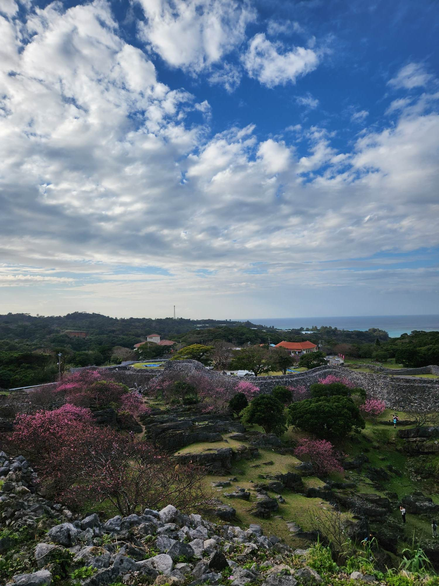

\

:::::: columns
::: {.column width="40%"}
{width="300"}
:::

::: {.column width="10%"}
<!-- empty column to create gap -->
:::

::: {.column width="40%"}
\
\
\
\
{width="300"}\
\
Left is a photo of spring blossom in Japan, taken by Sam.
:::
::::::

# Membership

Our numbers have grown! This happened despite the Steering Committee focusing mainly on other activities, rather than putting large efforts into recruiting new members! ***How to get involved***: If you have the opportunity, please do publicise the network. You could grab a relevant slide from [slides Sam made available](../posts/2023-03-01-RDN-at-ESJ.qmd). [Get various versions of the logo from here](https://github.com/ResponseDiversityNetwork/RDN-website/tree/main/assets/logo).

# Website

Owen and Ceres created this website during the last month or so. ***How to get involved***: If you'd like to help with it, perhaps contributing content, helping with appearance, or anything, please get in touch with one of us. If you know github, then take a look at [the website repo there](https://github.com/ResponseDiversityNetwork/RDN-website).

# Positioning paper

The Steering Committee is writing an introductory paper describing the Network and its goals. As part of this, Laura and others are designing a survey of experts to gauge the current state of response diversity research and researcher's attitudes towards/opinions about response diversity. ***How to get involved***: Please keep an eye out for (and respond to) the response diversity survey, which will be sent to all Network members and corresponding authors of relevant papers later this year.

# Symposium at GfO meeting in Leipzig

There will be a response diversity focused symposium at the 52nd Annual Meeting of the Ecological Society of Germany, Austria and Switzerland on 12-16 September 2023 in Leipzig. It is organised by Owen and Francesco Polazzo. Presenting in the symposium is by invitation only (sorry -- not totally in our control). ***How to get involved***: it would be great if many network members would submit abstracts to present in other relevant sessions. I imagine that we'll in any case organise a network social at the meeting.

# Workshop at OIST in March 2024

There will be a response diversity workshop held in Okinawa, Japan, in March 2024. Several members will be invited to stay for a little longer (upto one month) as part of the Okinawa Institute of Science and Technology (OIST) Graduate University's Theoretical Sciences Visiting Scholar Programme (by invitation only, sorry!), but the 3(ish)-day workshop will be open to many more members. The Workshop will coincide with the Ecological Society of Japan's Annual Meeting in Yokohama, so visitors may wish to also attend this conference. ***How to get involved***: Invitations have been sent to a range of members to encourage those from a range of backgrounds to attend (expenses covered). Additional participants are welcome to join (more details coming soon), though due to limited funds, we cannot fund any additional participants. We also encourage people to attend the Ecological Society of Japan meeting, and perhaps to organise a session (details coming soon).

# Pre-proposal for network coordination office in Zurich

Many networks like ours have a coordination office. We have an opportunity to propose a coordination office at the University of Zurich. This is a fantastic opportunity to take the network to the next level, and a great time to do so while the network is quite young and still developing its identity, aims, and activities. Owen and Sam, supported by the steering committee will be working on a proposal over the next month or so. ***How to get involved***: Please reach out to us if you'd like to help.
