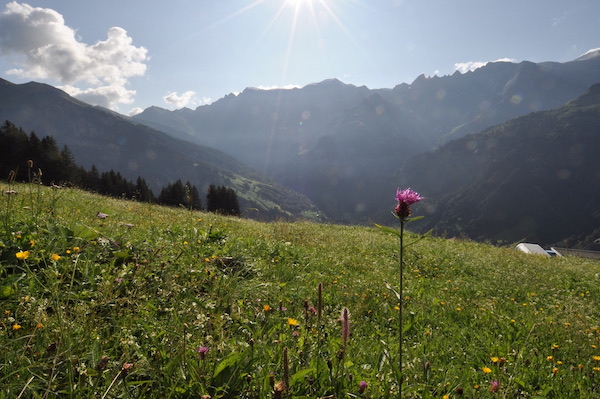

\

:::::: columns
::: {.column width="40%"}
{width="300"}
:::

::: {.column width="10%"}
<!-- empty column to create gap -->
:::

::: {.column width="40%"}
{width="300"}\
\
Left is a photo of summer in the Alps.
:::
::::::

# Scope of network

The founders of the network were mostly ecologists, and although they had broad interests, the network's perspective on response diversity research was rather ecologically dominated. Inspired by the paper [Response diversity as a sustainability strategy, by Brian Walker et al., published in early 2023)](https://www.nature.com/articles/s41893-022-01048-7) the network has taken steps to expand its scope. It now has numerous authors of that paper as members, and has revised its web pages. ***How to get involved***: We still have work to do to represent a wider variety of response diversity research. You can help by pointing out what we might have missed (to Owen or Sam, for example).

# Membership

Our numbers have grown again! This happened despite the Steering Committee focusing mainly on other activities, rather than putting large efforts into recruiting new members! ***How to get involved***: If you have the opportunity, please publicise the network. You could grab a relevant slide from [slides Sam made available](../posts/2023-03-01-RDN-at-ESJ.qmd). [Get various versions of the logo from here](https://github.com/ResponseDiversityNetwork/RDN-website/tree/main/assets/logo).

# Positioning paper

The Steering Committee is writing an introductory paper describing the Network and its goals. As part of this, we are designing a survey of experts to gauge the current scope and state of response diversity research and researchers' attitudes towards/opinions about response diversity. ***How to get involved***: Please keep an eye out for (and respond to) the response diversity survey, which will be sent to all Network members and corresponding authors of relevant papers later this Summer.

# Response diversity at the GfO meeting in Leipzig

The network will be present, so if you're coming to [the meeting](https://www.gfoe-conference.de/) then please let's meet up! There is the Symposium, with six great speakers (Mike Fowler, Shyamolina Gosh, Lina Mühlbauer, Conor Waldock, Sofia van Moorsel, & Alain Danet). Also, we will have a social on Tuesday evening. Please drop Owen a line if you'd like to come, so we can know numbers and organise something appropriate. ***How to get involved***: Come to the Symposium, come to the social :)

# Workshop at OIST in March 2024

There will be a response diversity workshop held in Okinawa, Japan, 26-28 March 2024. The Ecological Society of Japan's Annual Meeting will also take place earlier in March in Yokohama, so visitors may wish to attend both events. ***How to get involved***: Preliminary invitations were sent last year to a range of members to encourage those from a range of backgrounds to attend (expenses covered). More formal invitations will be extended soon. Additional participants are welcome to join (more details coming soon), though due to limited funds, we cannot fund additional participants. We also encourage people to attend the Ecological Society of Japan meeting, and perhaps to organise a session (details coming soon).

# Network coordination

In the April newsletter, we mentioned an opportunity to propose a coordination office at the University of Zurich. Unfortunately, it was not possible to prepare a proposal in time, so we still look for opportunities to fund a coordination office. ***How to get involved***: research possible funding opportunities and please let us know what you find.

# Virtual seminar series

We plan to launch a monthly virtual seminar series to give members the opportunity to connect and showcase their work. Because of our geographical distribution, we should be able to accommodate the speakers' timezone and will record talks for anyone who cannot attend but wants to. ***How to get involved***: please let us know if you'd be interested in being one of the first speakers (30-45 minute talks, as suits you!).

# Connect in person

***How to get involved***: Please reach out to Sam if there's interest in meeting up at [EAFES (Jeju, Korea)](https://www.eafes2023.or.kr/kor/), to Ceres or Hannah at [BES Macro (Birmingham, UK)](https://www.britishecologicalsociety.org/event/bes-macro-2023/), to Laura at [ESA (Portland, USA)](https://esa.org/portland2023/), or Owen, Mike, or Takehiro at [GFO (Leipzig, Germany)](https://www.gfoe-conference.de/) this Summer. We hope to see some of you in person soon!
