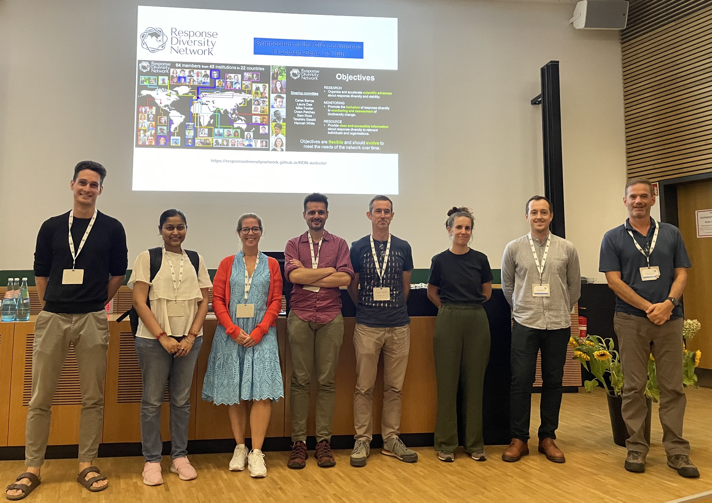
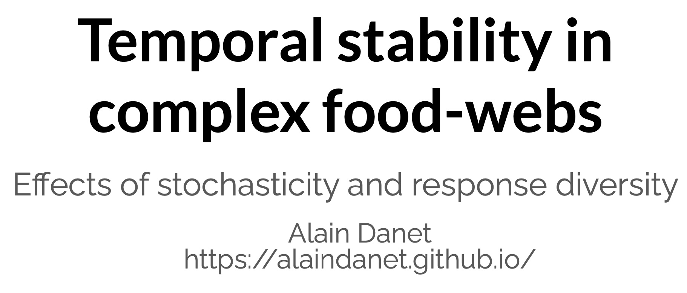
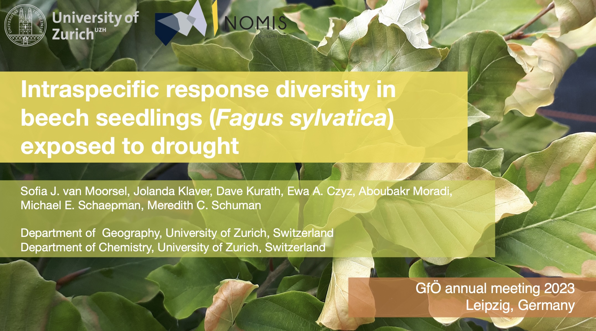
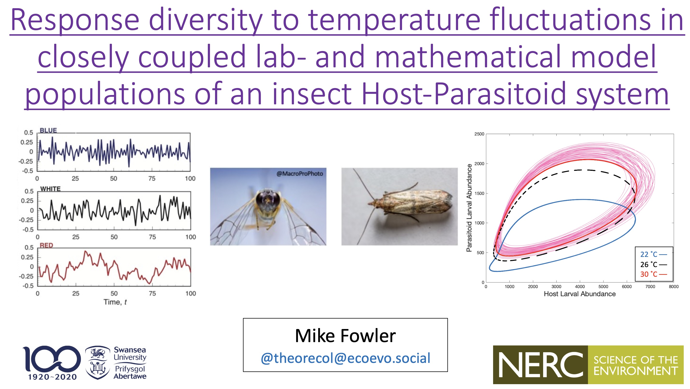
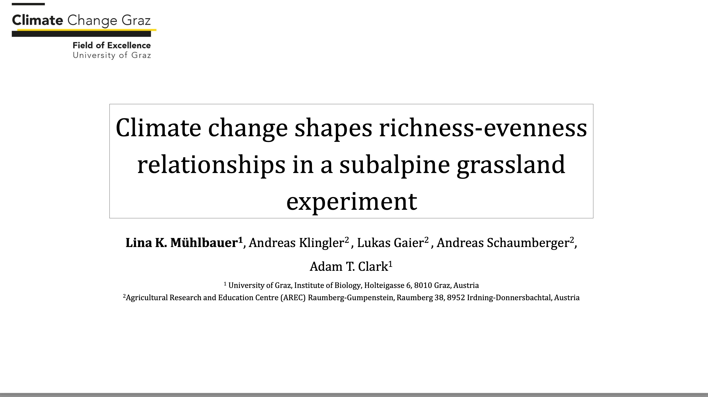
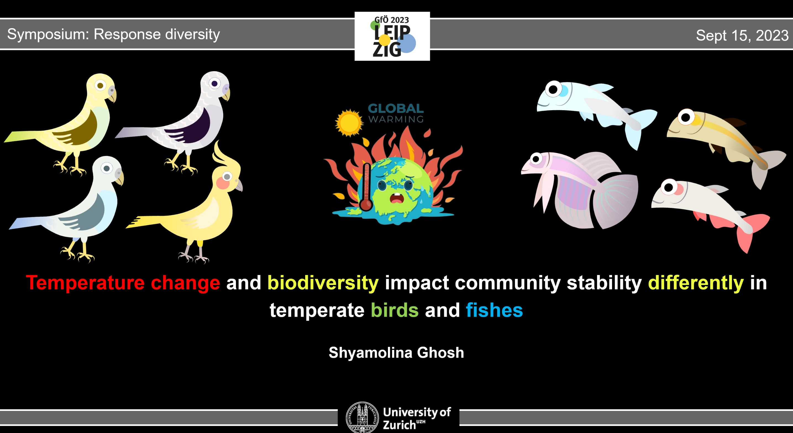
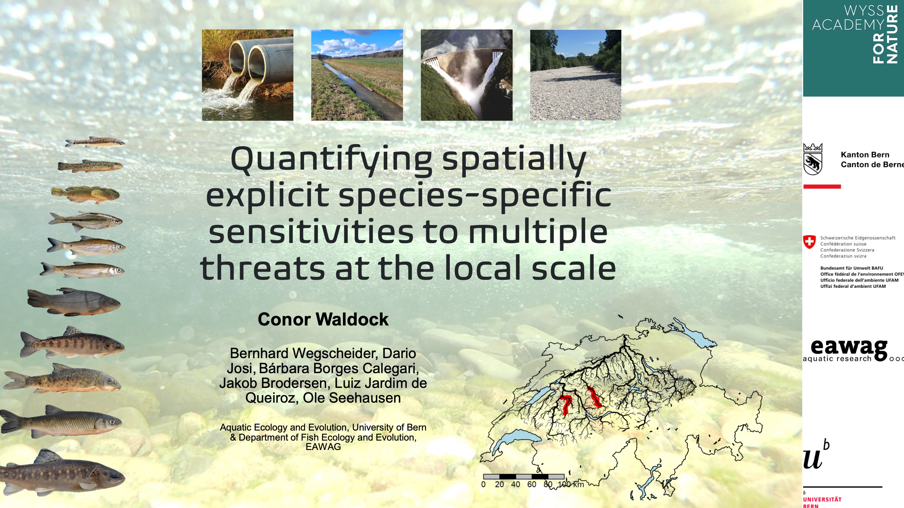

# Response diversity: theory, observations, experiments, and applications

*A symposium at the 2023 GfO meeting.*

*Leipzig, 2023, 15th September*

*Symposium organized by Owen Petchey and Francesco Polazzo, University of Zurich*

{width="300"}

*Left to right: Francesco Polazzo (organizer), Shyamolina Ghosh, Sofia van Moorsel, Alain Danet, Mike Fowler, Lina Mühlbauer, Conor Waldock, Owen Petchey (organizer).*

The symposium provided a forum for researchers to gather, share, and discuss work about response diversity. It also provided a stage on which to see opinion about what is response diversity. The opinions were broad and highlighted a need for further work on this. The symposium lies in the broader efforts of the recently formed Response Diversity Network which the organisers of the proposed session represent. We would like to give great thanks to the organisers of the [GfO meeting](https://www.gfoe-conference.de). It was a fantastic meeting with excellent content and organisation. Thank you.

Here's some short information about each of the six excellent talks. Please contact the speakers if you'd like to learn more and discuss.

## Temporal stability in complex food webs -- Effects of stocaticity and response diveristy

*Alain Danet, University of Sheffield*

{width="300"}

Alain presented his work based on a bioenergetic food-web model. He investigated the effects of environmental stochasticity and response diversity on temporal stability of community biomass.

## Intraspecific response diversity in beech seedlings (*Fagus sylvatica*) exposed to drought

*Sofia J. Van Moorsel, University of Zurich*

{width="300"}

Sofia presented the results from a recent experiment where beech tree seedlings coming from multiple locations over Europe were exposed to a simulated drought. They measured plants' responses to drought looking whether tree coming from different geographic locations (and thus differing in their genotypes) show different responses to drought.

## Response diversity to temperature fluctuations in closely coupled lab- and mathematical model populations of an insect Host-Parasitoid system

*Mike Fowler, Swansea University*

{width="300"}

Mike presented work response diversity to a feature of temporal fluctuations in temperature (or any environmental variable). This feature is the colour of the flucutations, with reddened fluctuations being when current temperature is relatively similar to recent temperature. He found evidence of response diversity to the colour of the flucutations.

## Climate change shapes evenness richness relationships in a subalpine grassland experiment

*Lina Mühlbauer, University of Graz*

{width="300"}

Lina presented results of the ClimGrass experiment in which carbon dioxide, temperature, and drought were manipulated. Results shows that one feature of the response diversity of a community -- the richness-evenness relationship, was altered by the treatments, despite there being no clear effects on either richness or evenness alone.

## Temperature change and biodiversity impact community stability differently in temperate birds and fishes

*Shyamolina Gosh, University of Zurich*

{width="300"}

Shyamolina exposed her work investigating how temperature change and biodiversity affect community stability in birds and fish. She found that increasing variation in species response to temperature change (i.e., response diversity) decreased overall community synchrony. On the other hand, increasing extreme temperature led to more variability among species' thermal tolerance limits which reduced interspecific synchrony at the extremes for birds.

## Quantifying spatially explicit species-specific sensitivities to multiple threats at the local scale

*Conor Waldock, University of Bern*

{width="300"}

By inferring environmental effects on occurrence using explainable AI, Conor was able to reveal response diversity to some environmental drivers, such as temperature, but less to others, such as river discharge.
