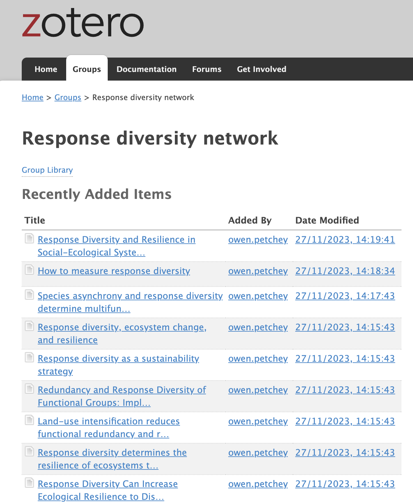

# A library of response diversity related papers in Zotero

{width="150"}

We've made a **library of response diversity related papers** in [Zotero](https://www.zotero.org/). We created the library in November 2023 and will add more papers as we go along.

We also created a **Response Diversity Network group** in Zotero, for the library to sit within.

We would love to have help adding papers to the library and keeping it up to date. If you'd like to help, please contact Owen. (The library is open for anyone to view, but can only be edited by invitation.)

### To view the library online and in Zotero app:

1.  Go to [www.zotero.org](www.zotero.org) and log in with your account;

2.  Join the [Response Diversity Network group](https://www.zotero.org/groups/5297762/response_diversity_network);

3.  Go to the [response diversity library](https://www.zotero.org/groups/5297762/response_diversity_network/library).

You should be able to see the library in "My group libraries" both online and in the Zotero app.

### To view the library online ONLY:

1.  Go to [www.zotero.org](www.zotero.org) and log in with your account;

2.  Go to the [response diversity library](https://www.zotero.org/groups/5297762/response_diversity_network/library).

The library will appear under "Other group libraries" but will not sync with your Zotero App.
