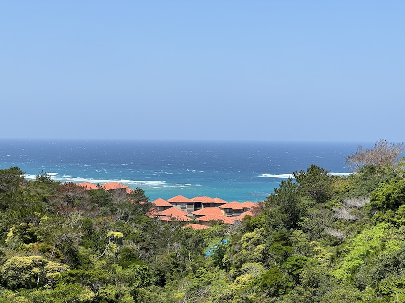
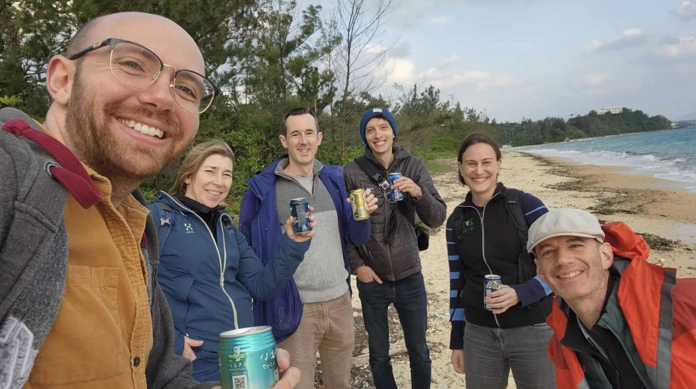
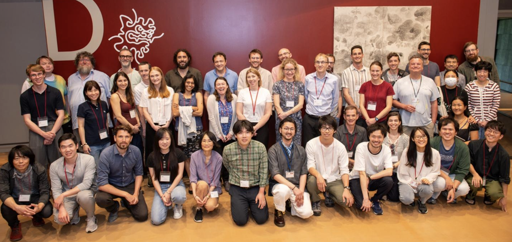

\

::: columns
::: {.column width="40%"}
{width="300"}
:::

::: {.column width="10%"}
<!-- empty column to create gap -->
:::

::: {.column width="40%"}
{width="300"}\
\
Left is a photo of the view down to the sea from OIST, with roofs of some of the residences. Beautiful!
:::
:::

# Where to meet members of the network

Organised conferences are a great place for RDN members to meet. Some conferences where members will be present: 

* 10-12 July, [BES Macro](https://www.britishecologicalsociety.org/event/bes-macro-sig-cardiff-conference-2024/), Cardiff, UK (Hannah and other members will be there)
* 15-19 July, [International Statistical Ecology Conference](https://statisticalecology.org/), Swansea, UK (Mike and other members will be there)
* 4-9 August, [Ecological Society of America](https://www.esa.org/longbeach2024/), Long Beach, USA (Sam and other members will be there) 
* 21-25 October, [French Society of Ecology and Evolution](https://sfe2-2024.fr/en), Lyon, France (Owen and other members will be there) 
* 10-13 December, [British Ecological Society](https://www.britishecologicalsociety.org/events/bes-annual-meeting-2024/), Liverpool, UK (Mike and other members will be there)

The network can help with organising thematic sessions or symposia at conferences, for example by asking for interest from other members. If you are planning to organise a session and would like more participants, please let us know.

# March in Okinawa 

Several members of the network took part in a Visiting Program at the Okinawa Institute of Science and Technology [OIST](https://www.oist.jp/) in Japan throughout the month of March. There they worked on topics relevant to response diversity, gave talks, and engaged with the local OIST community, as well as experiencing the culture (and many Izakayas) of Okinawa. 

{width="300"}

*Members of the network enjoying a refreshing evening at Tancha beach in Okinawa.*

Several members of the network were present at the Ecological Society of Japan meeting during the month, held at Yokohama National University (near Tokyo). Sam and Takehiro organised a session at the conference with talks from Karen Abbott, Anna Eklöf, Owen Petchey, Hiroko Kurokawa, and Tad Dallas. It was a great chance for visitors to meet researchers based in Japan, and the session was well attended and the talks very well received. Thanks to all who took part! 

At the end of the month, we held a Workshop with even more members of the network joining us from various places around the world. The workshop was discussion-focused with very few talks, so we had three days of exciting discussion with lots of productive conversations and a real diversity of ideas. We have formed some project teams, so please keep an eye out for activities arising from the workshop in the not-too-distant future. 

{width="600"}

*Members of the network and local participants from OIST gathered for a 3-day response diversity workshop.*

# Response Diversity Network Seminar Series

March launched what we hope will be a seminar series introducing work by the members of the network. The talks are not necessarily focused on response diversity (though a few were!) but serve as an introduction to get to know each other. Why not watch some of them back on YouTube and get inspired to form new collaborations or take your work in new directions. 

The first 11 talks are available on the [Response Diversity Network YouTube channel](https://www.youtube.com/channel/UCflOe3PkZeoxI6-PM9DTPpg). 

Would you like to introduce your science to the membership of the network? We’re looking for more presenters to give online presentations about their work. A committee member will chair in a suitable timezone, and afterwards the talk will be hosted on YouTube for everyone to view in their own time. 

Please let us know if you would like to give a 30-45 minute introduction to your work!

# Membership

We made and put on this web site [an interactive map of members](https://responsediversitynetwork.github.io/RDN-website/who-we-are.html). ***How to get involved*** If you have the opportunity, please publicise the network. You could grab a relevant slide from [slides Sam made available](../posts/2023-03-01-RDN-at-ESJ.qmd). [Get various versions of the logo from here](https://github.com/ResponseDiversityNetwork/RDN-website/tree/main/assets/logo).

# New initiatives

Groups within the network are self-organising to apply for various activities and events. Sometimes they reach out to the whole network, whereas sometimes sub-groups form rather spontaneously. The steering committee tries to get an overview of these initiatives as they arise. We (Sam, Owen, and steering committee) would be very happy to hear of other opportunities, and to try to provide assistance with applications etc. so please let us know if you’re planning something relevant.

At the moment, we know of two applications in the pipeline by two spontaneous groups: 

* Anna Eklöf is leading an application for a [Marie Skłodowska-Curie Actions Doctoral Network](https://marie-sklodowska-curie-actions.ec.europa.eu/calls/msca-doctoral-networks-2024), which would fund a cohort of PhD students to work in Europe, with possible secondments (6+ months) to members of the network across the world. Best of luck Anna et al!
* Sam is leading an application to the [Banff International Research Station for Mathematical Innovation and Discovery](https://www.birs.ca/) to fund a 2026 workshop on response diversity. 

We also have ideas to organise a [Congressi Stefano Franscini / Monte Verita conference in Switzerland](https://csf.ethz.ch/), and to connect with the [bioagora Horizon Europe](https://bioagora.eu/) project which connects biodiversity knowledge and decision-making. Both of these projects would need leaders to see them to fruition, so if anyone is interested in getting involved in this, or organising anything else of relevance to the network, please let us know. 

That’s all for now. We hope to see you sometime in the coming months!

With best wishes from the Response Diversity Network Steering Committee
Sam, Owen, Ceres, Hannah, Laura, Mike, Takehiro

