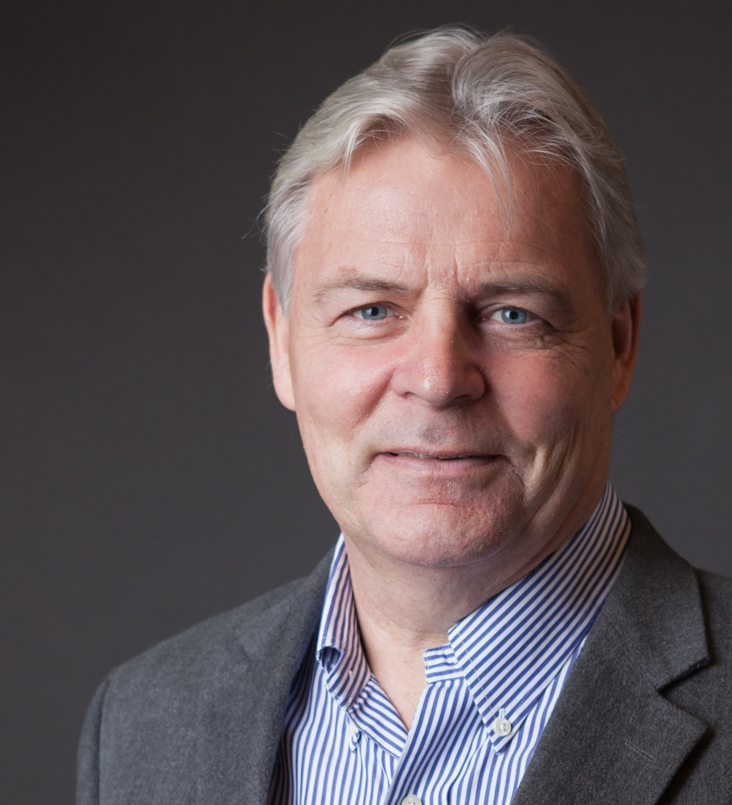

\

:::::: columns
::: {.column width="40%"}
{width="220"}
:::

::: {.column width="10%"}
<!-- empty column to create gap -->
:::

::: {.column width="40%"}
{width="300"}\
\
Professor Thomas Elmqvist will give an online presentation on Wednesday 29th January at 8-9am CET. Thomas is a professor in Natural Resource Management at Stockholm University, and has a long history of working on urban ecology and sustainability. He will talk about response diversity as a sustainability strategy. 
:::
::::::

# Response diversity as a sustainability strategy

Financial advisers recommend a diverse portfolio to respond to market fluctuations across sectors. Similarly, in nature a diverse portfolio of species has evolved leading to ecosystem functions often maintained despite environmental fluctuations. In urban planning, public health, transport and communications, food production, and other domains, however, this feature often seems ignored. As we enter an era of unprecedented turbulence at the planetary level, I argue that ample responses to this new reality --- that is, response diversity --- can no longer be taken for granted and must be actively designed and managed. I outline what response diversity is, how it is expressed and how it can be enhanced and lost.

# The details

When: Wednesday 29th January at 8-9am CET (7-8am GMT, 3-4pm JST, 2-3am EST, 11pm-12am PST) Where: The seminar will be held on Zoom [click here](https://uzh.zoom.us/j/65819676888?pwd=17iOnrua5tut4vNqoN2GEWcVoUFcsF.1), will be recorded, and will be made available afterwards on the [RDN Youtube channel](https://www.youtube.com/channel/UCflOe3PkZeoxI6-PM9DTPpg).

# By the way

We aim to have seminars on every last Wednesday of the month. If you have any suggestions for future speakers, please let us know. We will alternate the time of the seminars to accommodate different time zones.
