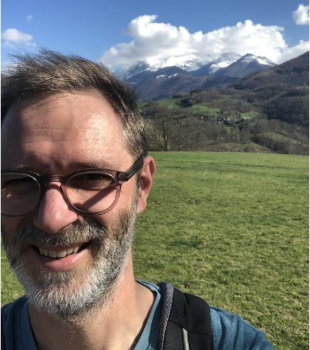

\

:::::: columns
::: {.column width="40%"}
{width="200"}
:::

::: {.column width="10%"}
<!-- empty column to create gap -->
:::

::: {.column width="40%"}
{width="300"}\
\
Prof. Frederik De Laender will give an online presentation on Wednesday 30th April at 11:00-12:00 CEST. Frederik is a Professor at the University of Namur in Belgium. His interests span coexistence and stability, eco-evolutionary feedbacks, and the consequences of multivariate environmental change and biodiversity change for functioning. He will provocatively ask, "Is environmental change research a mess?" and I look forward to his answer!
:::
::::::

# Is environmental change research a mess?

Environmental change research is seemingly plagued by the curse of dimensionality: the number of environmental drivers is large, different species respond differently to each of these changes, and different communities can harbour different kinds of species interactions. This raises the pressing question if a general understanding of environmental change effects on communities is achievable, or if effects are highly context-dependent instead. My talk is an overview of past and ongoing projects that support the former assertion. I will focus on impacts on local and regional species coexistence, competitive communities and food chains, and network stability. Taken together, these examples suggest some regularity to impacts of global change, which is encouraging for science and society.

# The details

When: Wednesday 30th April at 11:00-12:00 CEST (10:00 UK, 18:00 Japan, 05:00 Eastern, 02:00 Pacific, 09:00 UTC) Where: The seminar will be held on Zoom [click here](https://oist.zoom.us/j/3604469169?pwd=VzZKVVBRMEFLdnV0eUF3SmRXNVpQZz09) hosted by Sam Ross. It will be recorded and made available afterwards on the [RDN Youtube channel](https://www.youtube.com/channel/UCflOe3PkZeoxI6-PM9DTPpg).

The Zoom link again (copy and paste): https://swanseauniversity.zoom.us/j/92171014107?pwd=LgadWhV6VaoJHk09T3kRth1v61aA79.1

# By the way

We aim to have seminars on every last Wednesday of the month. If you have any suggestions for future speakers, please let us know. We will alternate the time of the seminars to accommodate different time zones.
