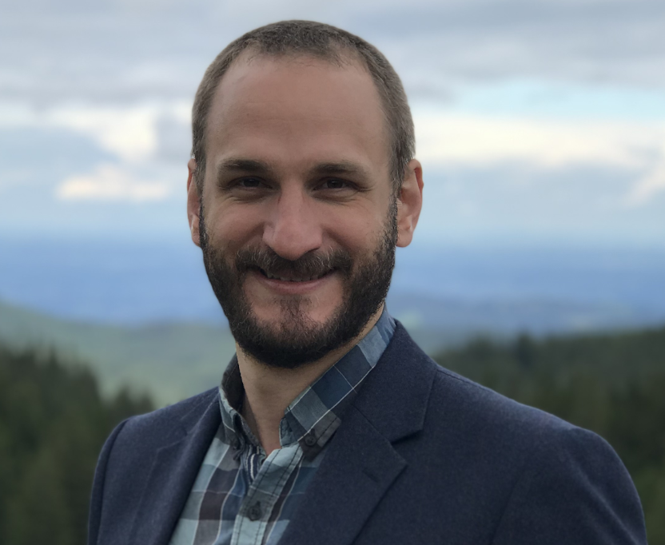

\

::: columns
::: {.column width="40%"}
{width="200"}
:::

::: {.column width="10%"}
<!-- empty column to create gap -->
:::

::: {.column width="40%"}
{width="300"}\
\
Dr. Adam Clark will give an online presentation on Wednesday 25th May at 18:00-19:00 CEST. Adam is an Associate Professor in the Department of Biology at the University of Graz, Austria. His interests broadly include mathematical theory, field-based natural history, and predictive models of communities. In his talk, Adam will ask when response diversity is relevant for single pulse perturbation.
:::
:::

# When is response diversity relevant in relation to single pulse perturbations?

It is well-understood how response diversity can increase temporal stability for systems undergoing repeated pulse perturbations. In particular, negative covariance among the responses of individual species can lead to a reduction in average community-level variability relative to that at the species level. In response to individual perturbations, however, things are a bit different. Given, say, a single drought event, the highest stability in community-level biomass production is (perhaps unsurprisingly) achieved when all species show high resistance to drought - i.e. when their responses covary positively. In contrast, if we instead focus on the overall displacement in biomass caused by the pulse perturbation (i.e. the squared magnitude of the change in community-level biomass), then negative covariance among species responses can still contribute to increased stability. In this talk, I will walk through the steps I've taken to analyse and quantify these responses as part of a disturbance experiment, and ask for your help in relating these findings to other (better) theoretical studies, as well as to help work out a few problems I've been having with the derivations.

# The details

When: Wednesday 25th June at 18:00-19:00 CEST (17:00 UK, 01:00 Japan, 12:00 Eastern, 09:00 Pacific, 16:00 UTC) Where: The seminar will be held on Zoom ([click here](https://cuboulder.zoom.us/j/92462505521)) hosted by Laura Dee. It will be recorded and made available afterwards on the RDN YouTube channel. [RDN Youtube channel](https://www.youtube.com/channel/UCflOe3PkZeoxI6-PM9DTPpg).

[Zoom link](https://cuboulder.zoom.us/j/92462505521)

# By the way

We aim to have seminars on every last Wednesday of the month. If you have any suggestions for future speakers, please let us know. We will alternate the time of the seminars to accommodate different time zones.
