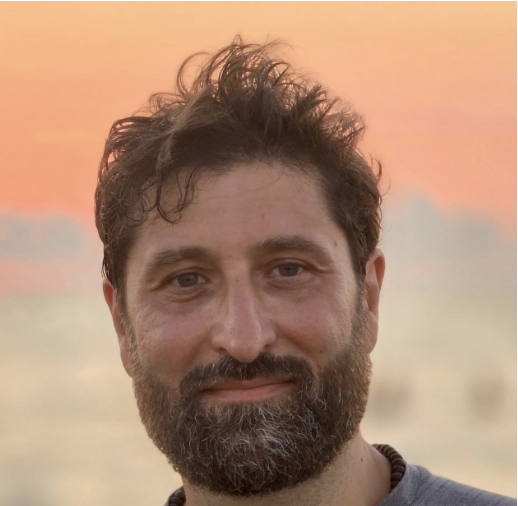

\

::: columns
::: {.column width="40%"}
{width="200"}
:::

::: {.column width="10%"}
<!-- empty column to create gap -->
:::

::: {.column width="40%"}
{width="300"}\
\
Dr. Francesco De Bello will give an online presentation on Wednesday 24th September at 10:00-11:00 CEST. Francesco is a senior plant ecologist and agronomist at the Desertification Research Center (CSIC), Spain, and Associate Professor at the University of South Bohemia. He works on functional trait diversity, climate and land-use change impacts, ecological stability, and ecosystem services, combining field, greenhouse, and modelling approaches.
:::
:::

# Functional trait effects on ecosystem stability: assembling the jigsaw puzzle

Ecologists have delineated multiple mechanisms by which local biodiversity could control the temporal stability of ecosystem properties. Theories and empirical evidence are accumulating suggesting that, together with different population and community parameters, these mechanisms largely operate through differences in functional traits among organisms. In this talk potential trait-stability mechanisms are reviewed, together with underlying tests and associated metrics from population level to community and meta-community level studies. An overview on existing studies and evidence from empirical studies are also provided, including both intraspecific and interspecific trait diversity. Different trait-based components are presented, each accountable for different stability mechanisms, that contribute to buffering, or propagating, the effect of environmental fluctuations on ecosystem functioning. This comprehensive picture, obtained by combining different puzzle pieces of functional trait effects on stability, should ideally guide future empirical and modelling investigations.

# The details

When: Wednesday 24th September at 10:00-11:00 CEST (09:00 UK, 17:00 Japan, 04:00 Eastern, 01:00 Pacific, 08:00 UTC) Where: The seminar will be held on Zoom [click here](https://oist.zoom.us/j/3604469169?pwd=VzZKVVBRMEFLdnV0eUF3SmRXNVpQZz09) hosted by Sam Ross. It will be recorded and made available afterwards on the [RDN Youtube channel](https://www.youtube.com/channel/UCflOe3PkZeoxI6-PM9DTPpg).

The Zoom link again (copy and paste): https://oist.zoom.us/j/3604469169?pwd=VzZKVVBRMEFLdnV0eUF3SmRXNVpQZz09

# By the way

We aim to have seminars on every last Wednesday of the month. If you have any suggestions for future speakers, please let us know. We will alternate the time of the seminars to accommodate different time zones.
