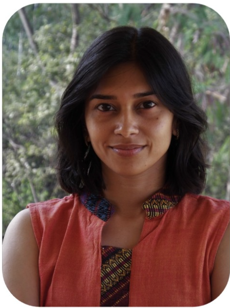

\

:::::: columns
::: {.column width="40%"}
{width="180"}
:::

::: {.column width="10%"}
<!-- empty column to create gap -->
:::

::: {.column width="40%"}
{width="300"}\
\
Dr. Meghna Krishnadas will give an online presentation on Thursday 30th October at 08:30-09:30 IST. Meghna leads the Community and Functional Ecology (CaFE) lab at the National Centre for Biological Sciences in India, where she works on plant functional traits, biotic and abiotic environmental constraints on community assembly and dynamics, and demographic rates, among other interests. In her talk, she will discuss demographic responses to joint abiotic and biotic drivers. I look forward to finding out more!
:::
::::::

# The relative and interactive roles of abiotic and biotic drivers on demographic responses of plants

Biotic interactions play a central role in shaping population responses and community dynamics of ecological assemblages. Direct interactions between plants or those mediated by other organisms such as predators, pathogens and mutualists affect plant response to neighbors. When conspecific neighbors have a more negative effect than heterospecific neighbors on demographic performance, it can translate to self-limitation that helps stabilize species' populations and may aid coexistence. The strength and nature of stabilizing conspecific density dependence (sCDD) can vary with abiotic context at multiple spatial scales. We find moisture to be a key driver of sCDD variation across large- and small-scale gradients. These findings have implications for the processes that maintain diversity at different scales, and offer signals of how global environmental changes may alter the dynamics of early life-stages in plant communities.

# The details

When: Thursday 30th October at 08:30-09:30 IST (03:00 UK, 12:00 Japan, 23:00 Eastern, 20:00 Pacific, 03:00 UTC). Please note this is a Thursday.

Where: The seminar will be held on Zoom [click here](https://unimelb.zoom.us/j/82032964114?pwd=t4bQF44pWur0e6M2DXT48uwHhetled.1) hosted by Giulia Ghedini as part of "PopBio on the Dark Side". It will be recorded and made available afterwards on the [RDN Youtube channel](https://www.youtube.com/channel/UCflOe3PkZeoxI6-PM9DTPpg).

Zoom link: https://unimelb.zoom.us/j/82032964114?pwd=t4bQF44pWur0e6M2DXT48uwHhetled.1

# By the way

We aim to have seminars on every last Wednesday of the month. If you have any suggestions for future speakers, please let us know. We will alternate the time of the seminars to accommodate different time zones.
