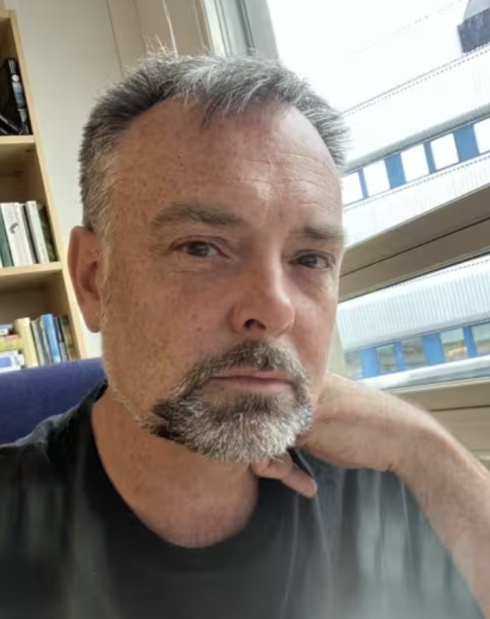

\

:::::: columns
::: {.column width="40%"}
{width="200"}
:::

::: {.column width="10%"}
<!-- empty column to create gap -->
:::

::: {.column width="40%"}
{width="300"}\
\
Prof. Pete Manning will give an online presentation on *Wednesday 26th November at 10:00-11:00 CET*. Pete is a Professor of Global Change Ecology at the University of Bergen in Norway, where he works on land use change, biodiversity-ecosystem functioning relationships, and increasingly on the socioecological dimension of global change and ecosystem services. In his talk, he will introduce us to ecosystem service multifunctionality, including exciting-sounding case studies. I look forward to finding out more!
:::
::::::

# Linking biodiversity and land use changes to societal impacts

Ecologists lack tools for quantitatively demonstrating how changes to ecosystems impact the social system that depends upon them. This limits our capacity to predict, demonstrate and minimise the impact of environmental change and biodiversity loss. In this talk I will show how metrics such as ecosystem service multifunctionality, the supply of multiple ecosystem services relative to human demand, can link biodiversity and land use change to stakeholder communities. This will be illustrated with examples from the large-scale and long-term German Biodiversity Exploratories and Kilimanjaro Social Ecological System (Kili-SES) projects. 

# The details

When: Wednesday 26th November at 10:00-11:00 CET (09:00 UK, 18:00 Japan, 04:00 Eastern, 01:00 Pacific, 09:00 UTC).

Where: The seminar will be held on Zoom ([click here](https://oist.zoom.us/j/3604469169?pwd=VzZKVVBRMEFLdnV0eUF3SmRXNVpQZz09)) hosted by Sam Ross. It will be recorded and made available afterwards on the [RDN Youtube channel](https://www.youtube.com/channel/UCflOe3PkZeoxI6-PM9DTPpg).

Zoom link again: https://oist.zoom.us/j/3604469169?pwd=VzZKVVBRMEFLdnV0eUF3SmRXNVpQZz09 

# By the way

We aim to have seminars on every last Wednesday of the month. If you have any suggestions for future speakers, please let us know. We will alternate the time of the seminars to accommodate different time zones.
