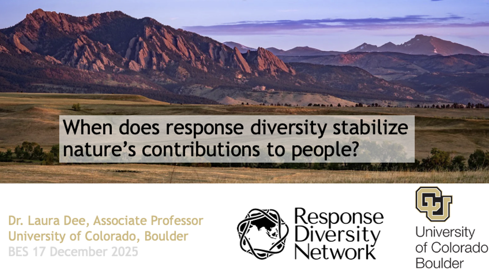
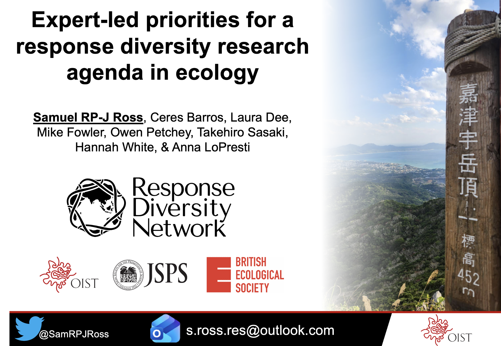
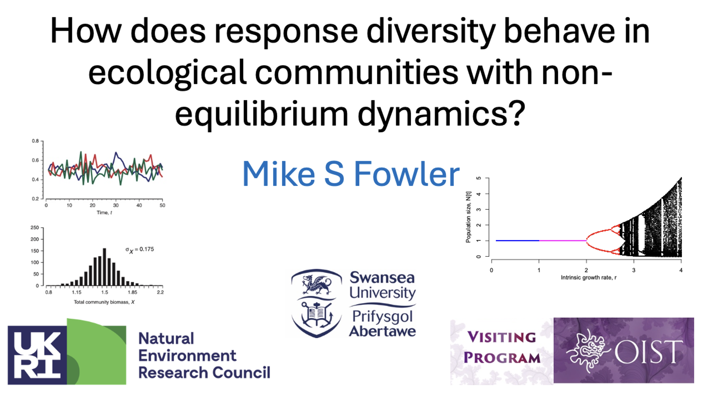
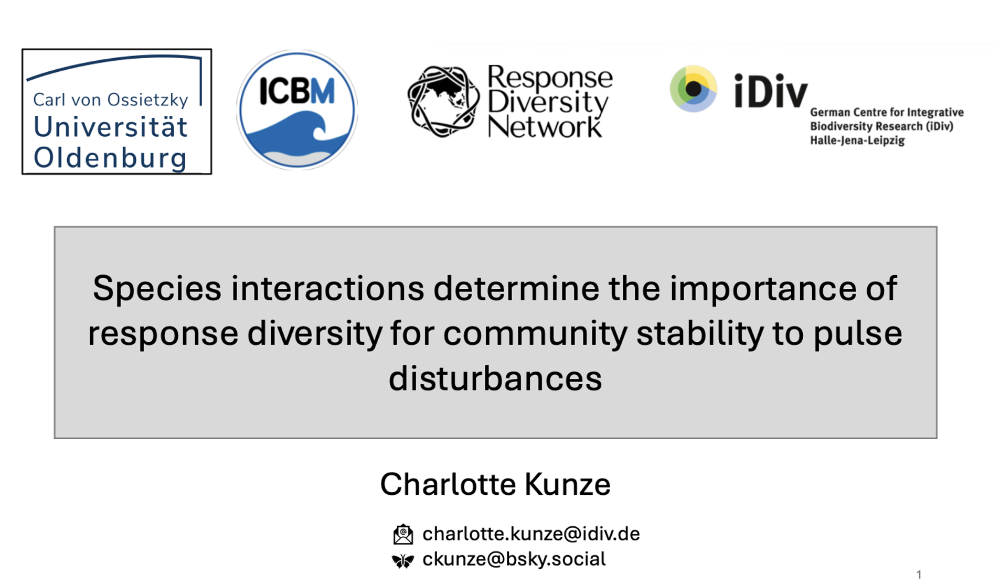
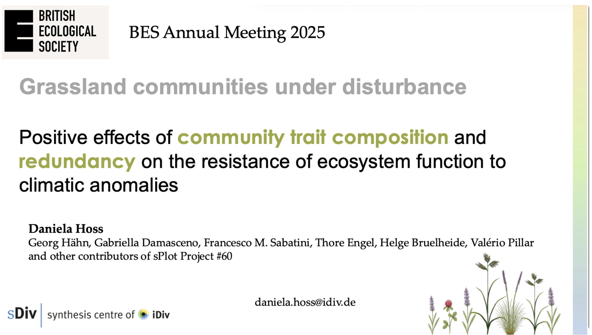
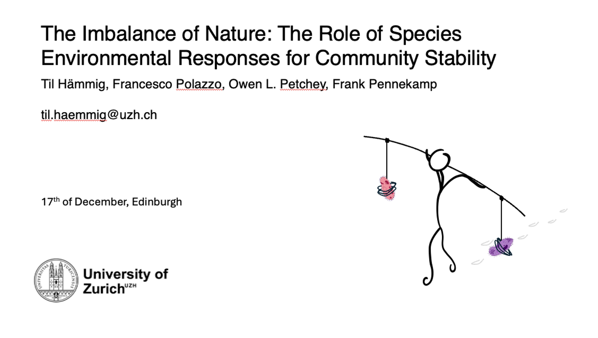
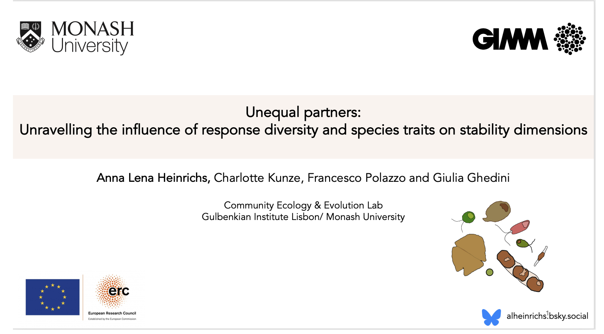

# Insurance in Ecosystems: Exploring the Role of Response Diversity across Scales

*A thematic session at the 2025 annual meeting of the British Ecological Society in Edinburgh in December 2025.*

*Organized by Francesco Polazzo, University of Zurich, and Charlotte Kunze, iDiv, Leipzig.*

The thematic session offered a dedicated space for researchers to meet, share their work, and exchange ideas on response diversity. It also provided an opportunity to observe the wide range of views on what response diversity encompasses. These diverse perspectives highlight an important need for continued conceptual and empirical work in this area.

This session forms part of the broader activities of the Response Diversity Network, which the session organisers represent. We are very grateful to the BES meeting organisers for hosting such an engaging and well‑run event. The meeting was excellent in both content and organisation --- thank you.

Below is a short summary of the seven outstanding talks presented in the session. Please feel free to contact the speakers directly if you’d like to learn more or continue the discussion.

## When does response diversity stabilize ecosystem functions and services?

*Laura E. Dee, University of Colorado Boulder (USA)*

{width="300"}

Laura’s talk explored why some ecosystems remain stable under intensifying global‑change disturbances such as drought and fire. She showed that response diversity—the way species within a community differ in their reactions to environmental stress—can help explain why grasslands around the world vary in their productivity responses to drought. However, she also highlighted that ecosystem stability and the stability of nature’s contributions to people (NCP) don’t always align. Her results suggest that while response diversity offers valuable insights into ecosystem functioning, more direct measures of NCP are needed to understand how global change will affect the benefits ecosystems provide to people.

## Expert-led priorities for a response diversity research agenda in ecology

*Samuel R.P-J. Ross, Okinawa Institute of Science and Technology Graduate University, Japan*

{width="300"}

Sam presented findings from a global expert survey showing that researchers hold widely differing definitions and expectations of response diversity, including which scales and stability dimensions it relates to. Experts identified major challenges, especially inconsistent methods and the difficulty of linking biotic interactions with environmental responses, but also expressed strong support for coordinated international efforts to move the field toward a more unified research agenda.

[Link to the paper](https://doi.org/10.1002/oik.11358)

## How does response diversity behave in ecological communities with non-equilibrium dynamics?

*Mike S Fowler, Swansea University, UK*

{width="300"}

Mike showed that many classic diversity–stability results rely on overly simple environmental variation, where species respond too similarly. Using a niche‑based community model with emergent environmental responses and an r–K trade‑off, he demonstrated that diversity–stability outcomes change when species have varied demographic strategies or non‑equilibrium dynamics. His key message: to understand when diversity stabilises ecosystems, models must include realistic, diverse species responses.

## Species interactions determine the role of response diversity for community stability to pulse disturbance

*Charlotte Kunze, iDiv, Halle-Jena-Leipzig, Germany*

{width="300"}

Charlotte’s talk showed that the stabilising role of response diversity depends strongly on the type of disturbance and on species interactions. Using simulations and a meta‑analysis, she found that under pulse disturbances, community stability is driven mainly by the average species response, while measures of response diversity (like dissimilarity and divergence) only matter when interspecific interactions are absent. Her work highlights that response diversity is stabilising under fluctuating conditions, but during sharp disturbances, stability is highest when species respond uniformly, either by resisting or recovering quickly.

[Link to the paper](https://doi.org/10.1111/ele.70299)

## Positive effects of functional redundancy on the resistance of ecosystem functionS to climatic anomalies.

*Daniela Hoss da Silva, Leipzig University, iDiv, Germany*

{width="300"}

Daniela examined how grasslands worldwide respond to increasingly frequent extreme dry and wet events, using 25 years of observational data from the sPlot database. She showed that both types of climatic anomalies reduce ecosystem resistance, but that communities with high functional redundancy or dominated by fast‑growing, acquisitive species are better buffered against these impacts. Her results highlight that response diversity helps maintain ecosystem stability across time and space.

## The imbalance of Nature: The Role of Species Environmental Responses for Community Stability

*Til Hämmig, University of Zurich, Switzerland*

{width="300"}

Til presented work on "The Imbalance of Nature", showing that community stability in fluctuating environments is driven not by species richness, but by how different species respond to the environment. Using a new metric called imbalance, derived from species’ performance curves, he showed that communities are most stable when species’ fundamental responses are more similar. A large microcosm experiment revealed that imbalance shapes both asynchrony and population stability, which together explain community stability. The talk highlighted a key message: species’ fundamental environmental responses, even measured in monoculture, can reliably predict community stability, challenging the assumption that interspecific interactions must dominate.

[Link to the paper](https://doi.org/10.1111/ele.70224)

## Unequal partners: Unravelling the influence of response diversity and species morphological and metabolic traits on stability dimensions

*Anna Lena Heinrichs, Gulbenkian Institute, Portugal*

{width="300"}

Anna‑Lena used phytoplankton experiments to uncover how species’ thermal traits, cell‑size plasticity, and response diversity shape community stability under heat waves. By measuring species’ thermal sensitivities across a wide temperature gradient and assembling communities with different trait compositions, she showed that species vary markedly in their ability to cope with heat stress. Thermal tolerance was not linked to cell size, indicating that size does not predict temperature resilience. Her work highlights how variation in species’ thermal responses helps explain community dynamics and the stability of key ecosystem functions under climate extremes.
