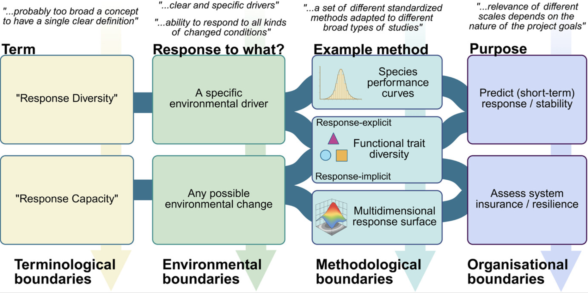

A new paper in Oikos, by members of the Response Diversity Network,  brings together expert perspectives on one of ecology’s most promising – and still surprisingly unsettled – ideas: response diversity.

{width="500"}

Response diversity refers to variation in how organisms respond to environmental change. The basic intuition is powerful: ecosystems should be more stable when species do not all react in the same way to disturbances. If some species decline under drought, others may persist or even thrive, buffering ecosystem functioning. This idea links biodiversity directly to ecological stability and resilience.

But despite two decades of conceptual development, uptake in empirical research and policy arenas has been slow.

To understand why, Ross and colleagues surveyed 69 researchers working on response diversity. The results reveal both enthusiasm and fragmentation. Experts disagree on:

* Definitions: Is response diversity variation among species? Individuals? Functional groups? Genes?
* "Response to what?": A specific environmental driver, or any possible future change?
* Links to stability: Does response diversity relate to persistence, resilience, asynchrony, variability—or all of them?
* Scale: Which temporal, spatial, or biological scales matter most?

In addition, ecological complexity—especially the role of species interactions and multiple simultaneous environmental stressors—makes it difficult to isolate and quantify stabilising effects. The field is also fragmented across temporal, spatial, and biological scales, with little consensus on which scales are most relevant. Together, these challenges highlight the need for clearer conceptual boundaries, flexible but comparable methods, and better integration of theory and empirical work.

A key takeaway is that the field does not necessarily need one rigid definition or a single standardised metric. Instead, respondents favoured conceptual coordination over methodological uniformity. The authors therefore propose developing a taxonomy of response diversity concepts—clarifying boundaries (e.g. response diversity vs. response capacity), data types (traits, performance curves, demographic rates), and levels of biological organisation. 

Another striking finding is a geographic imbalance: response diversity research is heavily concentrated in the Global North. Addressing this bias is essential if the concept is to become globally relevant for sustainability science.

To move the field forward, the authors launch and highlight the Response Diversity Network, an open, community-driven initiative aiming to coordinate syntheses, workshops, distributed experiments, and methodological development.

In short, this paper is less about providing final answers and more about building the roadmap. If response diversity is to fulfil its promise as a mechanistic link between biodiversity and stability in a changing world, it will require clearer concepts, flexible but comparable methods, cross-scale thinking—and a more globally inclusive community.

*Ross, S.R.P.-J., Barros, C., Dee, L.E., Fowler, M.S., Petchey, O.L., Sasaki, T., White, H.J. & LoPresti, A. (2026). Expert-led priorities for a response diversity research agenda in ecology. Oikos, n/a, e11358.*

[https://nsojournals.onlinelibrary.wiley.com/doi/10.1002/oik.11358](https://nsojournals.onlinelibrary.wiley.com/doi/10.1002/oik.11358)

