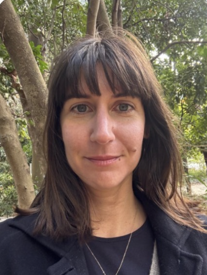

\

:::::: columns
::: {.column width="40%"}
{width="180"}
:::

::: {.column width="10%"}
<!-- empty column to create gap -->
:::

::: {.column width="40%"}
{width="300"}\
\
Dr. Giulia Ghedini will give an online presentation on **Thursday 27th August at 13:00-14:00 AEST**. Giulia is based in the School of Biological Sciences at Monash University, Australia. In her talk, she will discuss links between species traits, community assembly, and ecological stability.
:::
::::::

# Linking species traits to community assembly and stability

Predicting the composition and dynamics of ecological communities is challenging because complexity increases rapidly with species richness. Trait-based approaches are a desirable way to reduce this complexity, but which traits consistently inform on species' success in communities and their responses to environmental change remains debated. I will present recent work from my lab that uses phytoplankton to test the importance of species traits and interactions for predicting community assembly. I will then discuss how trait diversity affects different metrics of community stability.

**This seminar is co-hosted by the Response Diversity Network Members seminar series and the [PopBio on the Dark Side](https://www.youtube.com/@PopBio-ontheDarkSide) series.**

# The details

When: Thursday 27th August at 13:00-14:00 AEST (12:00 Japan, 05:00 CEST, 04:00 UK, 23:00 Eastern, 20:00 Pacific, 03:00 UTC). Please note this is a Thursday. See your local time [here](https://www.timeanddate.com/worldclock/fixedtime.html?msg=PopBio+on+the+Dark+Side+Online+Seminar&iso=20260827T13&p1=47&ah=1).

Where: The seminar will be held on Zoom [click here](https://unimelb.zoom.us/j/82032964114?pwd=t4bQF44pWur0e6M2DXT48uwHhetled.1).

Zoom link: https://unimelb.zoom.us/j/82032964114?pwd=t4bQF44pWur0e6M2DXT48uwHhetled.1

# Upcoming talks

24 September: Eloise Skinner (The University of Queensland, Australia)

29 October: Jamie Kass (Tohoku University, Japan)

# By the way

These seminars are open to anyone. Please share this announcement with your lab groups and other interested folk. If you have been forwarded this announcement, you can sign up to receive future seminar announcements via [this google form](https://docs.google.com/forms/d/e/1FAIpQLSd7thHC69Ra8pUXLoSw1Hh81cceha0A-KhqDp5NJ9LQLips7g/viewform?usp=dialog). Past seminars are available on [Youtube](https://www.youtube.com/@PopBio-ontheDarkSide).
