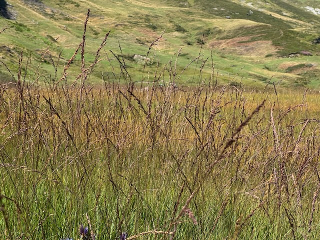

{width="300"}

The Response Diversity Network is moving into a new phase. Since the network began, much of the work of coordination has been guided by the Steering Committee and carried out rather informally, often by a small number of people. That was a good way to get started: light, flexible, and based on enthusiasm. But the network has grown, and so have the number of ideas, seminars, workshops, research projects, and possible links with policy and practice.

To keep that energy moving, we are upgrading the way the network is led and run. From 2026, the network will be governed and coordinated by a **Leadership Team**. The aim is not to make the network more bureaucratic. Quite the opposite: the aim is to make it easier for members to know who to contact, how to get involved, and how new activities can move from good ideas to things that actually happen.

# The 2026-2029 Leadership Team

The first Leadership Team will serve from 2026 to 2029. Some positions are held by members of the former Steering Committee, giving continuity from the early years of the network, and we are also welcoming new people into leadership roles.

- Chair: Owen Petchey
- Deputy Chair: Sam Ross
- Secretary: Mike Fowler
- Research representative: Open
- Membership representative: Takehiro Sasaki
- Outreach and Publicity representative: Hannah White
- Outreach and Publicity representative: Christoph Novotny
- Policy and Impact representative: Ceres Barros
- Ordinary representative: Laura Dee
- Ordinary representative: Open

The open positions are important. They are an invitation for the network to keep broadening the range of people shaping its direction. We especially welcome interest from members who can bring new perspectives, help connect response diversity to different regions or disciplines, or support activities that would otherwise remain on the "good idea, no owner yet" list.

# What the roles are for

Each role has a practical purpose. The Chair and Deputy Chair will help with strategy, planning, and implementation. The Secretary will coordinate meetings, minutes, newsletters, and internal communication. The Research representative will help motivate and support research activities, including projects, meetings, workshops, conference sessions, the seminar series, and shared resources such as the RDN Zotero library.

The Membership representative will help build the membership, support inclusivity and diversity, welcome new members, and keep the member list and map useful. The Outreach and Publicity representatives will help keep the website active, share news about seminars and member publications, and develop our public presence. The Policy and Impact representative will help connect response diversity research with policy, business, and wider society. Ordinary representatives will contribute ideas, attend Leadership Team meetings, help with decisions, and support other roles where needed.

# What this means for members

For most members, the main change should be simple: it should become clearer how to take part. If you have an idea for a workshop, conference session, seminar, synthesis project, policy-facing activity, website post, or other network activity, there should be a more obvious route for moving it forward. We also hope the new structure will support more peer-to-peer communication, so that members hear about activities earlier and have more chances to join them before they appear in a newsletter.

Over the coming months the Leadership Team will develop a strategy and implementation plan, clarify guidelines for network activities, and work on community standards for topics such as project involvement, authorship, and intellectual contribution. These things matter because many of the most exciting opportunities in the network are collaborative. Clearer expectations should help collaborations be generous, fair, and easier to join.

# Getting involved

The network remains open, member-led, and dependent on the initiative of the people in it. If you would like to help with research coordination, membership, outreach, publicity, policy and impact, or one of the open Leadership Team roles, please get in touch.

More details will follow as the Leadership Team begins work. In the meantime, thank you to everyone who has helped build the network so far, and to everyone who will help shape what comes next.
