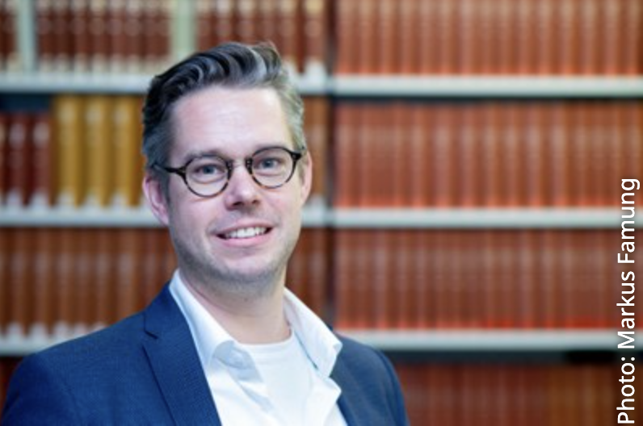

\

:::::: columns
::: {.column width="40%"}
{width="300"}

*Photo: Markus Farnung*
:::

::: {.column width="10%"}
<!-- empty column to create gap -->
:::

::: {.column width="40%"}
{width="300"}\
\
Prof. Dr. Robert R. Junker will give an online presentation on **Thursday 29th October at 12:15-13:15 CET**. Robert is based in the Department of Biology at Marburg University, Germany. In his talk, he will discuss mechanisms underlying ecological stability.
:::
::::::

# Mechanisms underlying ecological stability

Abstract to follow.

# The details

🕒 When: Thursday 29th October at 12:15-13:15 CET (Zurich time; 11:15 UK, 20:15 Japan, 07:15 Eastern, 04:15 Pacific, 11:15 UTC).

📍 Where: The seminar will be held on Zoom [click here](https://uzh.zoom.us/j/64390599791?pwd=MoADAJz6dJRRmHEu1pRdnxpMQPozU9.1). It will be recorded and made available afterwards on the [RDN Youtube channel](https://www.youtube.com/channel/UCflOe3PkZeoxI6-PM9DTPpg).

🤝 This seminar is in collaboration with the Department of Evolutionary Biology and Environmental Studies at the University of Zurich. Host: Owen Petchey. More information about the seminar series is available [here](https://www.ieu.uzh.ch/seminars/full_seminar_list.php?seminar=BEEES).

🔗 Zoom link: https://uzh.zoom.us/j/64390599791?pwd=MoADAJz6dJRRmHEu1pRdnxpMQPozU9.1

📅 [Add this seminar to your calendar](../assets/calendar/2026-10-29-robert-junker-seminar.ics)

# By the way

We aim to have seminars on every last Wednesday of the month. If you have any suggestions for future speakers, please let us know. We will alternate the time of the seminars to accommodate different time zones.
