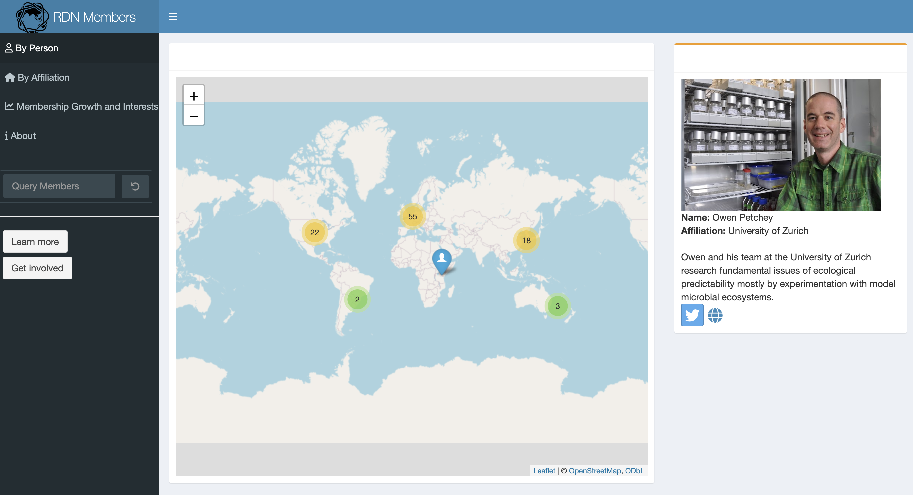

Responsive diversity is a transversal concept and so the network is open to anyone who would like to be part of a community of people interested in any and all things about response diversity. It includes researchers working on many types of systems, problems, and settings, including ecological systems, coupled social-ecological systems, economic-policy-behavioural systems, natural resources, urban landscapes, and nature-people relationships, to name but a few. This diversity is also represented in the many ways in which our research is done, including case studies, theoretical models, large-scale observations, manipulative experiments, and data analyses.

The network is currently composed of over 100 members from more than 50 institutions and 20 countries. Current members include early career researchers (e.g. PhD candidates), researchers later in their careers, and everything in between.

Click on the image of the members map below to be taken to a new webpage containing an interactive map of the network's members.

{fig-align="center" width="763"}

## Leadership Team

The network is now coordinated by a Leadership Team, which guides strategy, supports network activities, and helps turn members' ideas into seminars, workshops, research projects, conference sessions, outreach, and policy-facing work. This structure replaces the original Steering Committee, which helped establish and guide the network during its first years.

The Leadership Team for 2026-2029 is:

-   Chair: [Owen L. Petchey](https://www.ieu.uzh.ch/en/staff/member/petchey_owen.html) (University of Zurich, Switzerland)
-   Deputy Chair: [Samuel R.P-J. Ross](https://samuelrpjross.com/) (Okinawa Institute of Science and Technology Graduate University, Japan)
-   Secretary: [Mike Fowler](https://www.swansea.ac.uk/staff/m.s.fowler/) (Swansea University, UK)
-   Research representative: Open
-   Membership representative: [Takehiro Sasaki](http://www.sasa-lab.ynu.ac.jp/pukiwiki-151/index.php) (Yokohama National University, Japan)
-   Outreach and Publicity representative: [Hannah J. White](https://aru.ac.uk/people/hannah-white) (Anglia Ruskin University, UK)
-   Outreach and Publicity representative: Christoph Novotny
-   Policy and Impact representative: [Ceres Barros](https://ceresbarros.wordpress.com/) (University of British Columbia, Canada)
-   Ordinary representative: [Laura E. Dee](https://www.lauraedee.com/home) (University of Colorado, Boulder, USA)
-   Ordinary representative: Open

The open positions are an invitation for wider participation. If you are interested in helping with research coordination, network membership, or other activities, please contact us.
